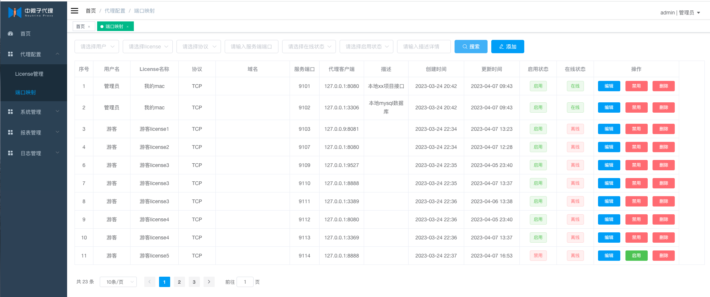

	

  <a href='https://gitee.com/dromara/neutrino-proxy/stargazers'></img></a>
<a href='https://gitee.com/dromara/neutrino-proxy/members'></img></a>

# 1、简介
- 中微子代理（neutrino-proxy）是一个基于netty的、开源的java内网穿透项目。
- 技术栈：Solon、MybatisPlus、Netty
- 遵循MIT许可，因此您可以对它进行复制、修改、传播并用于任何个人或商业行为。
- 官网地址1：https://neutrino-proxy.dromara.org
- 官网地址2：https://dromara.gitee.io/neutrino-proxy
- 官网地址3：https://neutrino-proxy-docs.asgc.fun
- 快速上手请[点击这里](https://dromara.gitee.io/neutrino-proxy/pages/793dcb)

# 2、名称由来
中微子，是轻子的一种，是组成自然界的最基本的粒子之一。它十分微小、不带电，可自由穿过地球，以接近光速运动，与其他物质的相互作用十分微弱，号称宇宙间的“隐身人”。

中微子是宇宙中穿透能力最强的物质,只有粒子之间的间隙小于10的负19次方米时,才能够阻挡住中微子。

因此以中微子命名，寓意着中微子代理拥有中微子"安全"、"快速"、"穿透力强"的特点。

# 3、运行示例

# 4、代理示意图

# 5、联系我们
- 微信: yuyunshize
- GitCode：https://gitcode.com/dromara/neutrino-proxy
- Gitee: https://gitee.com/asgc/neutrino-proxy

# 6、贡献者列表

#  ❤️ 感谢
* [Solon](https://gitee.com/noear/solon?from=NeutrinoProxy)
* [Hutool](https://hutool.cn?from=NeutrinoProxy)
* [JetBrains](https://www.jetbrains.com?from=NeutrinoProxy)

# 📚 Dromara 成员项目

